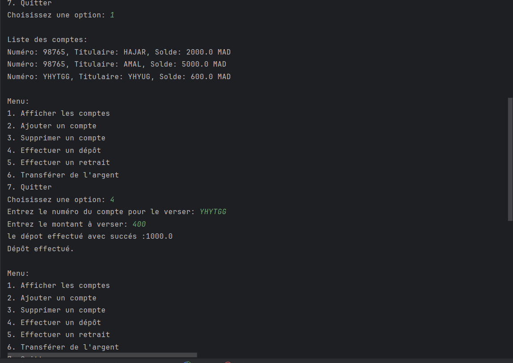
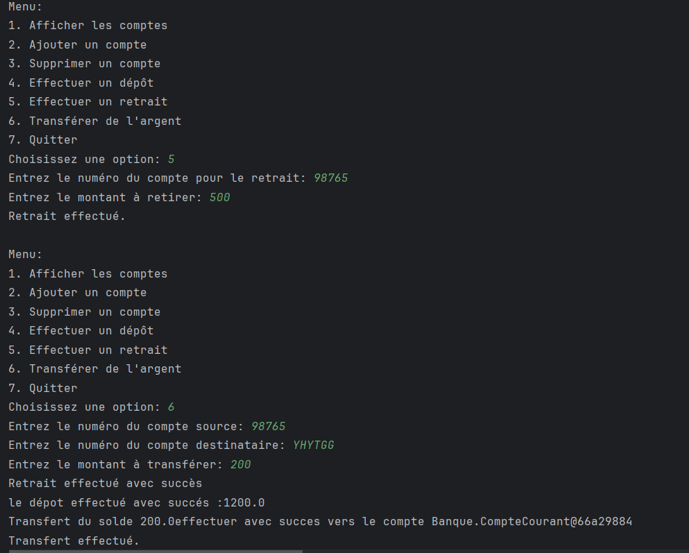

# 🚀 Gestion des Comptes Bancaires

Ce projet Java est une application de gestion de comptes bancaires utilisant la **programmation orientée objet (POO)**. Il permet de créer, gérer et effectuer des opérations sur des comptes bancaires tout en assurant une gestion correcte des exceptions.

## 🌟 Fonctionnalités

1. **Création de comptes bancaires** :
    - 🏦 Compte Courant (avec découvert autorisé)
    - 💰 Compte Épargne (avec taux d'intérêt)

2. **Opérations sur les comptes** :
    - ➕ Dépôt d'argent
    - ➖ Retrait d'argent (gestion des fonds insuffisants)
    - 🔄 Transfert d'argent entre comptes (gestion des comptes inexistants)

3. **Gestion des comptes** :
    - ➕ Ajouter de nouveaux comptes
    - 🗑️ Supprimer des comptes existants
    - 📊 Afficher les soldes des comptes

4. **Gestion des exceptions personnalisées** :
    - ❗ `FondsInsuffisantsException` : levée en cas de retrait ou transfert avec des fonds insuffisants.
    - ❌ `CompteInexistantException` : levée si un transfert est effectué vers un compte inexistant.

## 🛠️ Prérequis

- ☕ **Java** 8 ou version supérieure
- 🖥️ Un environnement de développement comme **IntelliJ IDEA**, **Eclipse**, ou simplement la ligne de commande avec `javac` et `java`.

## 📂 Structure du projet

- **Classe principale :** `Main`
- **Classes de base :**
    - `CompteBancaire`
    - `CompteCourant` (hérite de `CompteBancaire`)
    - `CompteEpargne` (hérite de `CompteBancaire`)
- **Exceptions personnalisées :**
    - `FondsInsuffisantsException`
    - `CompteInexistantException`

## 🚦 TESTER

